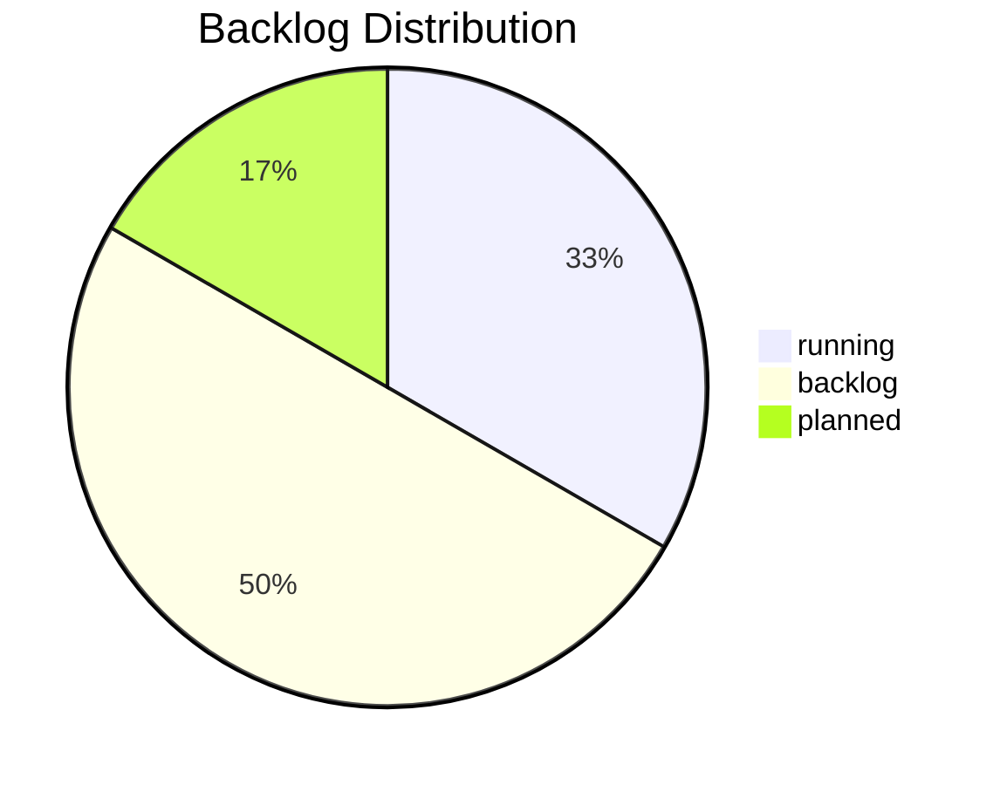

# 📊 Backlog Dashboard · v1.1 (AI-First Operational View)

## 1️⃣ System Overview

| Kategorie | Wert | Quelle |
|---|---|---|
| **Backlog Health (avg)** | 8.88 / 10 🟢 | diagnose_backlog_v1.0.json |
| **Impact-Score (avg)** | 8.7 | backlog_matrix_v1.1.md |
| **Trust-Score (avg)** | 8.7 | backlog_matrix_v1.1.md |
| **Effort-Load (avg)** | 5.5 | backlog_matrix_v1.1.md |

## 2️⃣ Prioritäten-Matrix (Top 5)
| Ticket | Layer | Category | Priority | Status |
|---|---|---|---:|---|
| AT-016 | Meta | Proof Mechanism | 9.3 | running |
| DOC-001 | Meta | Docs & Badges | 9.0 | backlog |
| AT-017 | Product | Action Plan Automation | 8.9 | running |
| GOV-003 | Meta | Archive Policy | 8.6 | planned |
| OPS-001 | Foundation | Probe Parameterization | 8.6 | backlog |

## 3️⃣ Cycle Overview (Roadmap)
| Cycle | Zeitraum | Fokus | Ziele | Tickets | Status |
|---|---|---|---|---|---|
| C1 | Okt–Nov 2025 | Proof & Action Plan | Proof-Mechanik messbar, KPIs im CI | AT-016, AT-017 | running |
| C2 | Dez 2025–Jan 2026 | Governance & Archive | Archiv-Policy, Lessons-Automation | GOV-003, OPS-001 | planned |
| C3 | Feb–Mär 2026 | Docs & Meta Upgrade | Badges, Roadmap 2.0, v1.9 Prep | DOC-001 | backlog |

## 4️⃣ Visual Snapshot

*Auto-rendered: 2025-10-16T14:55:26.100Z*
